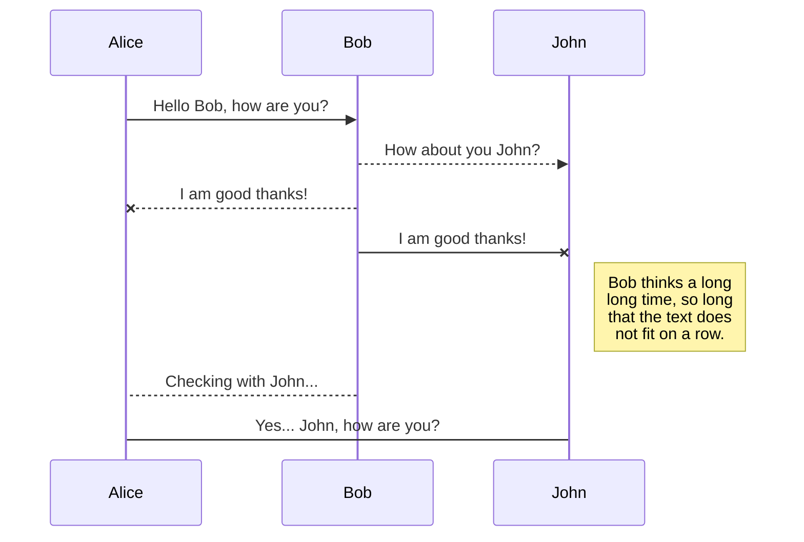
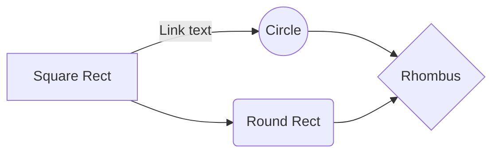

How to create github page with jekyll
<!-- more -->

# Posting github page with jekyll themes
Git이란?
프로젝트의 버전관리 소프트웨어로서, 많은 연구자가 참여하는 프로젝트의 경우, 수정작업이 동시다발적으로 이루어지기 때문에 변경내역에 대한 확인/추적이 필수적이다. 따라서, 작업내용이 중복되는 일을 사전에 방지하는 역할을 한다.

## 1. Fork 방법

### 테마 선택

- [Jekyll themes](href=http://jekyllthemes.org) -- Webjeda Cards 선택 -- Homepage

### 테마 Fork

(1) 우측상단 fork 클릭

(2) 다소 시간이 소요됨

(3) statpng 계정으로 fork된 것을 확인

(4) 그럼 이제 레퍼지토리 이름을 변경 (example)

(5) Github page로 설정

(6) 생성된 Github page url 클릭

(7) Webjeda cards 테마의 템플릿과 동일한 것을 확인

(8) *_config.yml*, **includes**/*header.html* 등을 수정하고 **_posts** 에 *.md* 또는 *.html* 파일을 추가하면 끝.

## 2. Jekyll & Ruby 방법

### Github 계정 생성

<figure>
	
	<!-- <figcaption>Github 계정생성 예시.</figcaption> -->
</figure>
> Repository명: yourname.github.io
: url을 https://yourname.github.io로 설정하기위함

### Jekyll [지킬]을 이용한 테마 설정

1. Ruby 설치
>  Ruby installer를 사용하자. 
   다운로드 사이트: [RubyInstaller for Windows](https://rubyinstaller.org/downloads/)  
   Ruby + Devkit의 2.4이상의 버전 설치

2. Ruby 설치 확인
>  ruby -v

3. jekyll Ruby Gem 설치 및 확인
> gem install bundler jekyll  
	jekyll -v

4. 프로젝트 생성
> jekyll new new-statpng.github.io

5. 테마 적용
> Jekyllthemes template을 new-statpng.github.io 폴더에 복사 붙여넣기 및 Gemfile, index.md 삭제

6. 구동 확인

jekyll serve
bundle exec jekyll serve


7. Github에 업로드_

	git init
	git checkout -b gh-pages
	git remote add origin https://github.com/statpng/new-statpng.github.io.github
	git add .
	git commit "initial commit"
	git push -u origin gh-pages


8. https://new-statpng.github.io 확인

## 설치

## KaTeX

You can render LaTeX mathematical expressions using [KaTeX](https://khan.github.io/KaTeX/):

The *Gamma function* satisfying $\Gamma(n) = (n-1)!\quad\forall n\in\mathbb N$ is via the Euler integral

$$
\Gamma(z) = \int_0^\infty t^{z-1}e^{-t}dt\,.
$$

> You can find more information about **LaTeX** mathematical expressions [here](http://meta.math.stackexchange.com/questions/5020/mathjax-basic-tutorial-and-quick-reference).

## UML diagrams

You can render UML diagrams using [Mermaid](https://mermaidjs.github.io/). For example, this will produce a sequence diagram:

And this will produce a flow chart:

