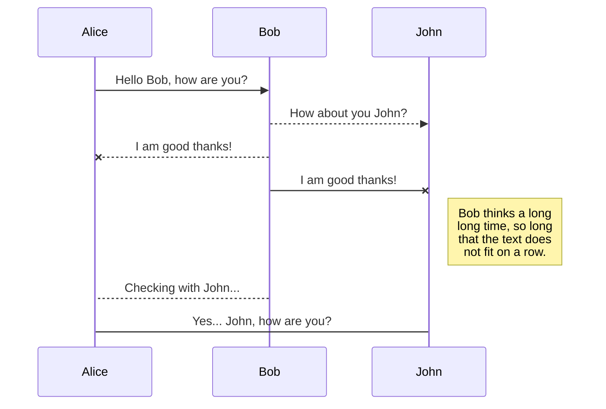
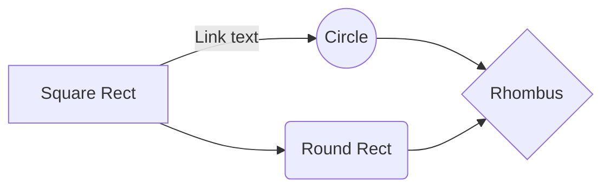

Regularization and variable selection via the elastic net

<!-- more -->
Regularization and variable selection via the elastic net
=========================================================

 *Journal of the Royal Statistical Society: series B (2005)* 

Hui Zou and Trevor Hastie
----------------------------------------------------------

# Introduction and motivation

## The criteria for evaluating the quality of a model

- Accuracy of prediction on the future data

- Interpretation of the model

## Several Regression Model

### OLS

- OLS often does poorly in both prediction and interpretation

### Ridge

- Ridge regression achieves its better prediction performance through a bais-variance trade-off.

- But, it cannot produce a parsimonious model.

### Best subset selection

- Best subset selection can produce a sparse model, but it is extremely variable.

### Lasso

- The lasso is a penalized least squares method imposing an L_1-penalty on the regression coefficients.

- Both continuous shrinkage and automatic variable selection simultaneously.

- Tibshirani and Fu compared the prediction performance of the lasso, ridge, and bridge regression(Frank and Friedman, 1993).

- None of them uniformly dominates the other two.

- In terms of variable selection, the lasso is much more appealing owing to its sparse representation.

- Limitations of the lasso
------------
In the p>n case, selecting at most **n** variables seems to be a limiting feature for a variable selection method.
------------
Moreover, the lasso is not well defined unless the bound on the L_1-norm of the coefficients is smaller than a certain value.
------------
If there is a group of varialbes among which the pairwise correlations are very high, then the lasso tends to select only one variable from the group and does not care which one is selected.
------------
For usual n>p situations, if there are high correlations between predictors, it has been empirically observed that the prediction performance of the lasso is dominated by ridge regression.(Tibshirani, 1996)

### Bridge

- sum_i=1:p{|beta_i|^q}

### Genomic data

- Since a typical microarray data set has many thousands of predictors (genes) sharing the same biological 'pathway', the correlations between them can be high.

- Those genes are forming a group.

## Methods

### Naive elastic net

- **Lemma 1**에서 rank of the X* = p 이기때문에, it can select at most p variables
- **Lemma 2**에서 변수 간 상관성이 매우 높은 극단적 케이스(xi=xj)일 때, strictly convex penalty와 the lasso penalty solution의 극명한 차이를 보여준다. -> 따라서 the lasso의 단점(the grouping effect)
- Deficiency: The naive elstic net does not perform satisfactorily unless it's very close to either ridge or lasso regression.

### Univariate Soft Thresholding
### Bayesian connections and the Lq-penalty
### PCA has been used to construct methods for finding a set of highly correlated genes. (Hastie et al (2000) and Diaz-Uriarte (2003))
### Tree harvesting (Hastie et al., 2003) uses supervised learning methods to select groups of predictive genes found by hierachical clustering)
### A careful study by Segal and Conklin (2003) strongly motivates the use of a regularization regression to find the grouped genes.

### Elastic net

- \hat{\beta}(elastic net) = \sqrt{1+\lambda_2} \hat{\beta *}
- Decorrelation step: (Xt*X+lambda*I)/(1+lambda)
- Shrunken estimate: In LDA, the prediction accuracy can often be improved by replacing \hat{\SIGMA} by a shrunken estimate (Friedman, 1989)(Hastie et al., 2001)
- Computation: an algorithm LARS-EN
  + Cholesky factorization (Golub and Van Loan, 1983)
  + Early stopping
  + \lambda_1에 대한 것과 k-th step에 대해 솔루션을 찾는 것이 거의 같다. (오히려 early stopping 솔루션에서는 the number of step로 찾는게 더 좋다.)
- Choice of tuning parameters

### Conditions to be a good classification method

(a) Gene selection should be built into the procedure.
(b) It should not be limited by the fact that p>>n.
(c) For those genes sharing the same biological pathway, it should be able to include whole groups into the model automatically once one gene among them is selected.

## KaTeX

You can render LaTeX mathematical expressions using [KaTeX](https://khan.github.io/KaTeX/):

The *Gamma function* satisfying $\Gamma(n) = (n-1)!\quad\forall n\in\mathbb N$ is via the Euler integral

$$
\Gamma(z) = \int_0^\infty t^{z-1}e^{-t}dt\,.
$$

> You can find more information about **LaTeX** mathematical expressions [here](http://meta.math.stackexchange.com/questions/5020/mathjax-basic-tutorial-and-quick-reference).

## UML diagrams

You can render UML diagrams using [Mermaid](https://mermaidjs.github.io/). For example, this will produce a sequence diagram:

And this will produce a flow chart:

